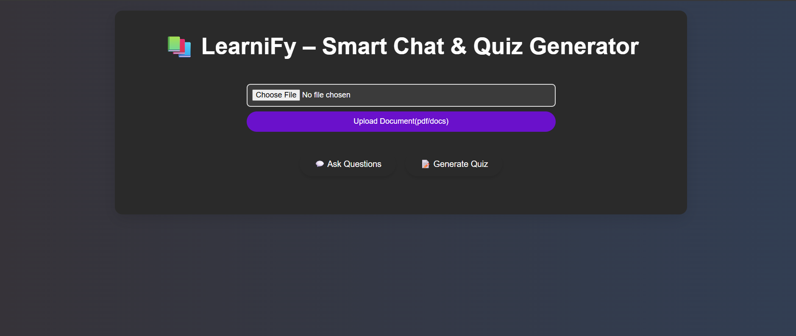
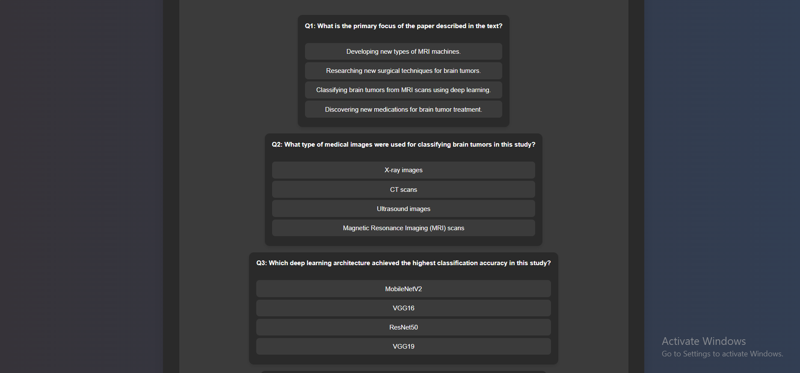
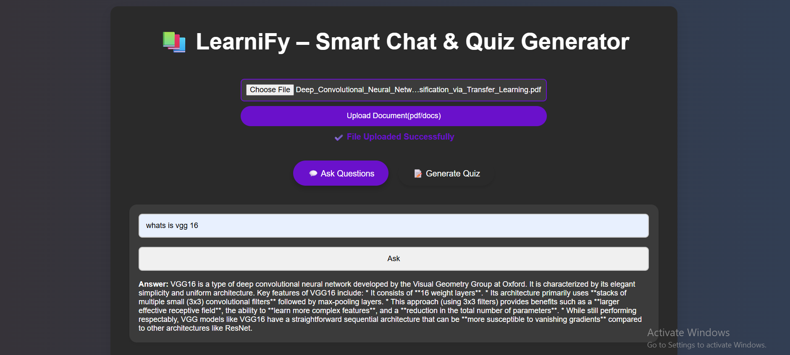

# Learnify - AI-Powered Educational Web Application  
##### International Islamic University Chittagong

## 📃 Table of Contents:
- [Introduction](#Introduction)  
- [Objective](#Objective)  
- [How to Use](#How_to_Use)  
- [Working Procedure](#Working_Procedure)  
- [Technology Stack](#Technology)  
- [Conclusion](#Conclusion)  
- [Snapshots](#Snapshots)

---

# <h1 id="Introduction">Introduction</h1>  

**Learnify** is a web application designed to assist teachers, students, and trainers by enabling them to upload study materials, interact with the content using AI, and automatically generate quizzes. This application aims to enhance the learning experience by helping users understand and review materials more effectively through AI-driven content interaction and quiz generation.


# <h2 id="Objective">📜 Objective</h2>  

1. **Goal**: To automatically generate quizzes based on uploaded educational documents and enhance user interaction through an AI-powered chat assistant.
2. **Focus**: Develop a responsive web application using modern technologies for content summarization, AI-assisted question answering, and quiz generation.
3. **Methodology**: The project will use AI algorithms to extract meaningful information from uploaded content and automatically create quizzes in multiple formats, such as multiple-choice, true/false, and short answer.
4. **Result**: Deliver a fully functional web app that streamlines the learning process with automated quizzes and AI-driven content explanations.


# <h2 id="How_to_Use">📜 How to Use</h2>  

### Setting up the project locally:

1. **Clone the repository**:  
   ```bash
   git clone https://github.com/Momit87/leanify_SD


2. **Install Dependencies**:
   Navigate to the project folder and install the required dependencies for both frontend and backend.

   * Frontend:

     ```bash
     cd learnify/frontend
     npm install
     ```

   * Backend:

     ```bash
     cd learnify/backend
     npm install
     ```

3. **Running the Application**:

   * To start the backend (Node.js + Express):

     ```bash
     cd learnify/backend
     npm start
     ```

   * To start the frontend (React.js):

     ```bash
     cd learnify/frontend
     npm start
     ```

   * The application should now be running at [http://localhost:3000](http://localhost:3000).

4. **Uploading Documents**:
   After logging in, navigate to the "Upload" section where you can upload documents in PDF, DOCX, or text format. The AI will automatically parse the document and generate related quizzes.

---

# <h2 id="Working_Procedure">Working Procedure</h2>

Learnify works by utilizing AI algorithms to process uploaded documents and generate quizzes automatically. Here's a quick overview of how the application operates:

1. **Document Upload**:
   Users can upload various types of documents (PDF, DOCX, text). The system processes these documents to extract meaningful content.

2. **AI Chat Assistant**:
   An AI assistant interacts with the content, answering questions based on the document uploaded. Users can ask the assistant specific queries about the document, and the AI will generate responses.

3. **Quiz Generation**:
   The AI analyzes the content and generates quizzes in multiple formats:

   * **Multiple Choice**
   * **True/False**
   * **Short Answer**

4. **User Interface**:

   * The user interface displays quizzes, tracks progress, and provides immediate scoring and explanations for each question.

---

# <h2 id="Technology">Technology Stack</h2>

* **Frontend**: React.js
* **Backend**: Node.js with Express.js
* **Database**: ChromaDB or PostgreSQL
* **AI Services**: Python-based AI models or external APIs
* **Deployment**: Heroku or Vercel

### Tools and Libraries:

* React for building the user interface
* Node.js and Express for backend services
* Python for AI processing and interaction
* MongoDB or PostgreSQL for storing user data and document metadata
* ChromaDB for document parsing and analysis

---

# <h2 id="Conclusion">Conclusion</h2>

Learnify combines modern web development technologies with AI to create a user-friendly platform for interactive learning. By automatically generating quizzes and providing AI-driven explanations of educational content, Learnify enhances the learning experience and helps users improve their comprehension of study materials.

---

# <h2 id="Snapshots">📷 Snapshots</h2>

Here are some screenshots of the application:

* **Homepage**:
  

* **Quiz Interface**:
  

* **AI Chat Assistant**:
  


### Key Features:
- **How to Use**: This section gives step-by-step instructions on how to set up and run the project locally.
- **Working Procedure**: A detailed breakdown of how the application processes uploaded documents and interacts with users.
- **Technology Stack**: Lists the key technologies used in the project.
- **Conclusion**: A final statement about the project’s goals and outcomes.
- **Snapshots**: A placeholder for images that demonstrate the application.

This professional structure ensures clarity and easy navigation for anyone using or contributing to your project.


